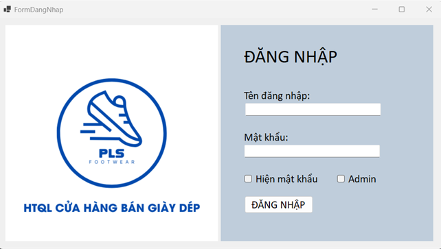
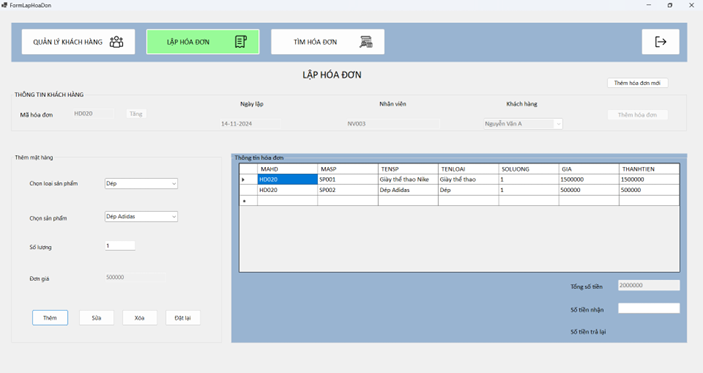
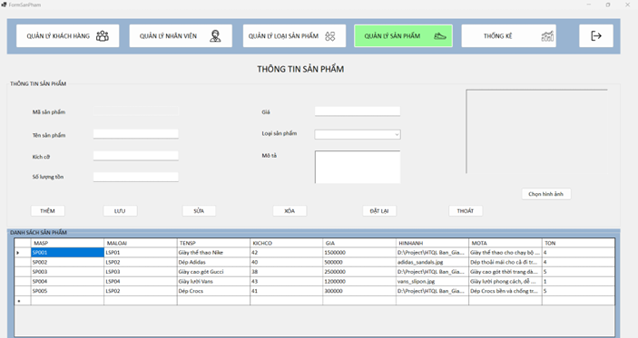
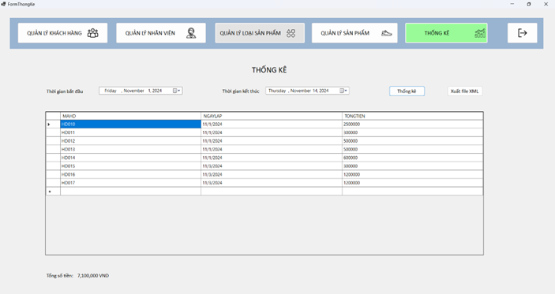
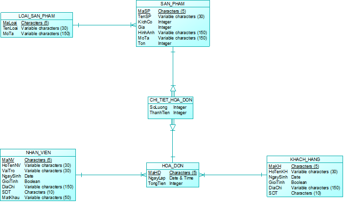

# Footwear Retail Management System

## 📝 Project Overview
This project is a comprehensive **Store Management System** specifically designed for footwear retailers. It streamlines daily operations by managing inventory, tracking customer interactions, and processing sales transactions through an intuitive desktop interface.

**Key Features:**
* **Inventory Management:** Track shoe products, categories, and stock levels in real-time.
* **Sales & Invoicing:** Generate professional invoices and calculate change for customers instantly.
* **Human Resources:** Manage employee profiles and roles (Manager/Staff).
* **Customer Relationship Management (CRM):** Maintain detailed records of customer information and purchase history.
* **Business Intelligence:** Visualize revenue reports and export sales data to Excel/XML for analysis.

## 🛠 Tech Stack
* **Language:** C#
* **Framework:** .NET WinForms
* **Database:** Microsoft SQL Server
* **Architecture:** ADO.NET for robust database connectivity
* **Tools:** Visual Studio 2022, SQL Server Management Studio (SSMS) 

## 📸 System Demo

### 1. User Authentication
A secure login interface with role-based access control for Admins and Staff.


### 2. Professional Invoicing (Main Feature)
The core module for processing sales, adding items to carts, and finalizing transactions.


### 3. Product & Stock Management
Detailed product control including pricing, categories, and inventory monitoring.


### 4. Sales Statistics & Analytics
Real-time revenue tracking and data export capabilities for business owners.


### 5. Database Schema (CDM)
Well-structured relational database design to ensure data integrity.


## ⚙️ Installation & Setup

### 1. Prerequisites
* **Visual Studio 2022** with **.NET desktop development** workload.
* **SQL Server** (Developer or Express edition). 
* **SQL Server Management Studio (SSMS)** 

### 2. Database Setup
1. Open **SSMS** and connect to your local SQL Server instance.
2. Import Data-tier Application.
3. Open and execute the `.bacpac` script provided in this repository to set up tables and sample data.

### 3. Project Configuration
1. Clone this repository:
   ```bash
   git clone [https://github.com/phong2103470/ShoesStore-Management-System.git](https://github.com/phong2103470/ShoesStore-Management-System.git)
2. Open the solution file (.sln) in Visual Studio 2022.
3. Open Ham.cs and update the connection string at line 17 to match your server name:
   ```bash
   string chuoiketnoi = "Server=YOUR_SERVER_NAME; Database=project; Integrated Security=True";
4. Build and Run
Press F5 to compile and launch the application.
Sample Credentials:
Username: NV001 
Password: 1231
## 🚀 Future Enhancements
[ ] Implement advanced product sizing. 

[ ] Develop an Online Ordering system for customers. 

[ ] Integrate Warehouse Import/Export documentation. 
## Author: Đào Trần Quốc Phong University: Can Tho University
